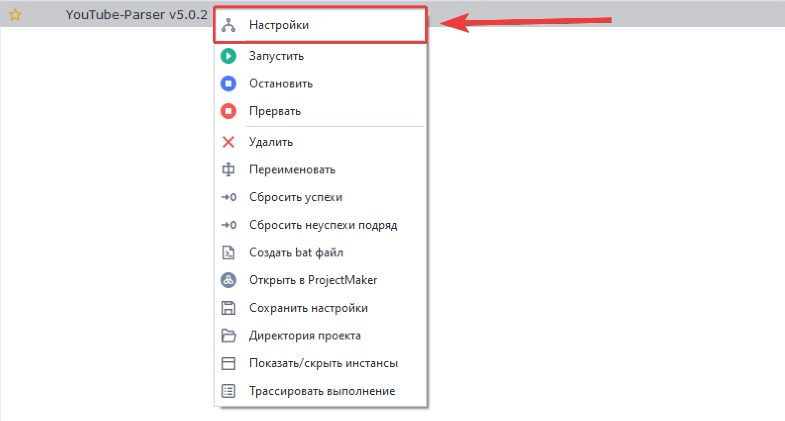
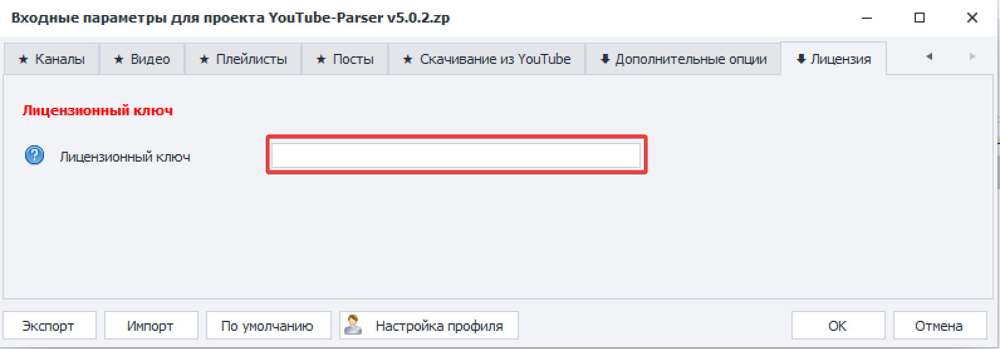
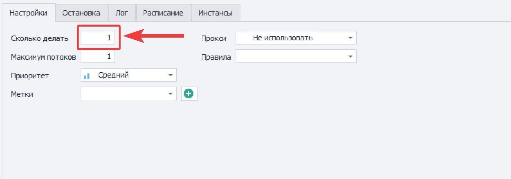
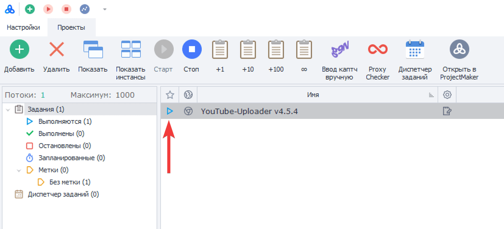
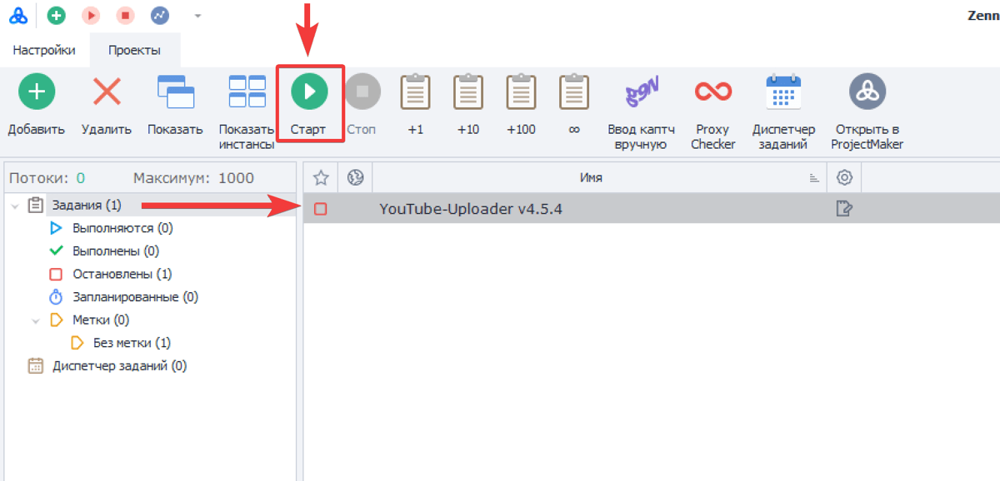
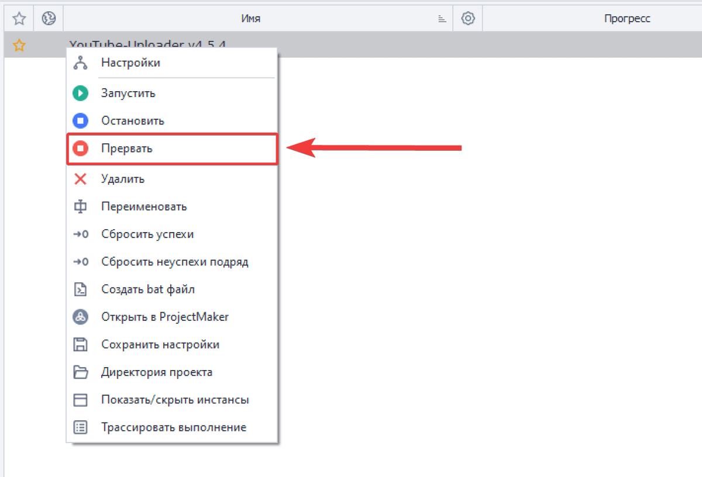
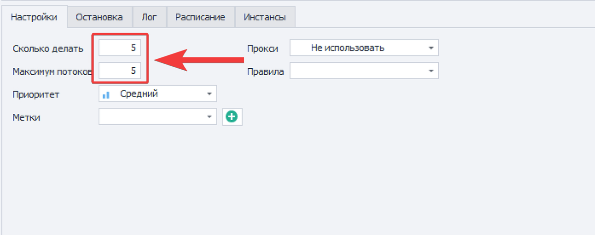

### Лицензионный ключ

Перед тем как запускать шаблон во входных настройках необходимо указать лицензионный ключ и задать параметры для выполнения шаблона. Для этого необходимо открыть настройки шаблона. Нажмите правой кнопкой мыши на шаблон и из контекстного меню выберите **«Настройки».**

{width=1584px height=852px}

После чего на последней вкладке Лицензия в поле **\[Лицензионный ключ\]** укажите ключ, который был вам выдан в письме с доступами.

{width=1592px height=557px}

### **Запуск выполнения**

Для того чтобы запустить шаблон необходимо проверить активна ли кнопка «**Старт**». Если нет, то шаблон находится в состоянии ожидания запуска. Если кнопка «Старт» активная, то нажмите на неё, чтобы перевести шаблон в состояние «**Ожидания**».

Так как шаблоны по умолчанию находятся в состоянии ожидания, то кнопка «Старт» чаще всего будет не активной.

{width=1200px height=521px}

Далее необходимо указать количество потоков, которое запустит ZennoPoster / ZennoBox для шаблона. Количество потоков указывается в поле «**Максимум потоков**».

{width=1200px height=413px}

В поле «**Сколько делать**» указывается количество попыток, которое шаблон будет выполнять для завершения указанного в настройках задания .

{width=1477px height=519px}

Для запуска шаблона в двух полях обязательно должны стоять значения больше «0», иначе выполнение не запустится. Запустите шаблон в 1 поток - для этого в поле «Максимум потоков» и «Сколько делать» укажите значение - «1». После чего шаблон запустится и перейдёт в состояние «**Выполняется**».

{width=1200px height=547px}

Если шаблон завершит выполнение успешно без каких-либо ошибок, то он вернётся в состояние «Ожидания» и для повторного запуска в поле «Сколько делать» достаточно будет указать значение - «1». Это вновь добавит для шаблона попытку выполнения задания.

Чтобы шаблон запускался он должен находиться в состоянии «Ожидания» и в полях «Максимум потоков» и «Сколько делать» пользователь должен задать значения больше 0.

### **Статус выполнения**

Помимо состояния «Ожидания» и «Выполнения» есть ещё состояние «**Остановлен**». Шаблон переходит в состояние «Остановлен», если пользователь нажал кнопку «Стоп» или намеренно прервал работу шаблона выполнив действие «Прервать», а также когда выполнение шаблона было прервано в результате ошибки. В таких случаях шаблон переходит в состояние «Остановлен» и не запустится пока не будет нажата кнопка «Старт».

{width=1200px height=578px}

### **Прерывание выполнения**

Чтобы прервать выполнение шаблона необходимо нажать по шаблону правой кнопкой мыши и из контекстного меню выбрать «**Прервать**». Выполнение шаблона будет прервано почти сразу и в лог будет выведено сообщение об ошибке выполнения.

После принудительного прерывания шаблона его необходимо перевести в состояние «Ожидания». Нажать на кнопку **«Старт»** и повторно указать значение для поля «Сколько делать».

{width=1200px height=816px}

### **Многопоточность**

Чтобы запустить шаблон многопоточно - в поле «**Сколько делать**» и «**Максимум потоков**» необходимо указать желаемое количество потоков.

Значение в поле «**Сколько делать**» должно совпадать со значением поля «**Максимум потоков**», иначе старт потоков будет происходить тем количеством, что указанно в поле «Максимум потоков».

Например, если требуется запустить шаблон в 5 потоков, то в двух полях должно быть указано значение «5».

Если требуется запустить шаблон 20 раз в 5 потоков. То в поле «**Сколько делать**» указывается значение - «20», а в поле «**Максимум потоков**» - «5».

{width=1200px height=475px}