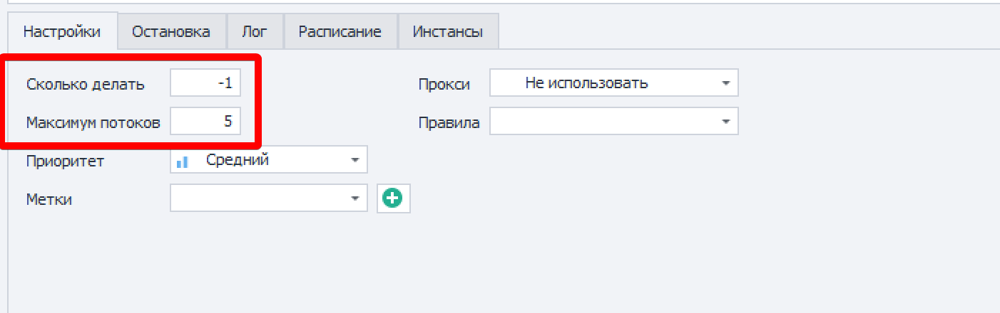
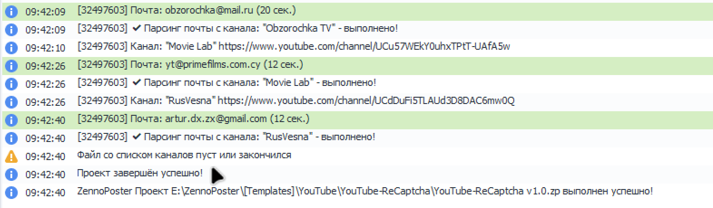
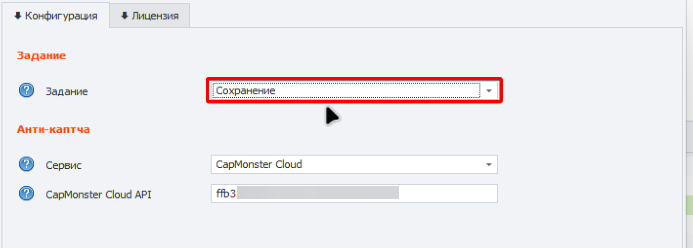
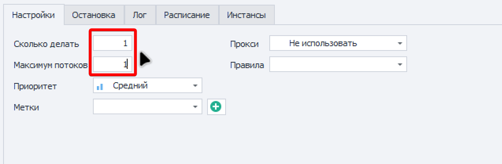
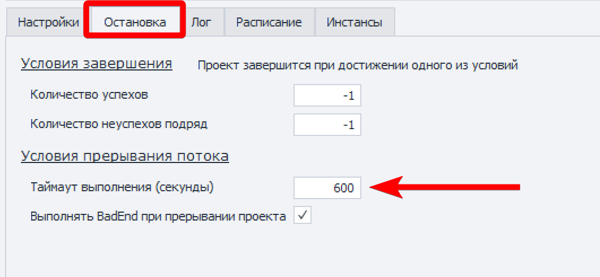
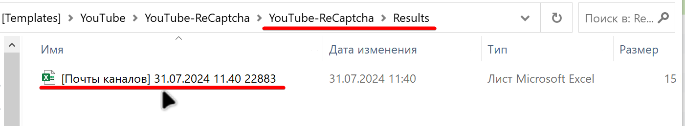

1. Запустите шаблон в соответствии с инструкцией: [Запуск шаблонов](https://docs.youtube-dorgen.com/installation/start)

Значение **Сколько делать** укажите по количеству файлов в папке 1_Ready или –1

{width=1402px height=440px}

\
После того как файл со ссылками на каналы закончится необходимо выполнить сохранение.

{width=1571px height=460px}

Во входных настройках шаблона выберите задание **Сохранение**

{width=1418px height=510px}

\
Запустите шаблон указав **Сколько делать** – 1 и **Максимум потоков** – 1

{width=1275px height=419px}

На панели управления потоками на вкладке **Остановка** укажите следующие параметры.

Это поможет избежать зависания инстансов во время работы.

{width=600px height=277px}

\
Таблица с результатами появится в папке Results

{width=1401px height=259px}