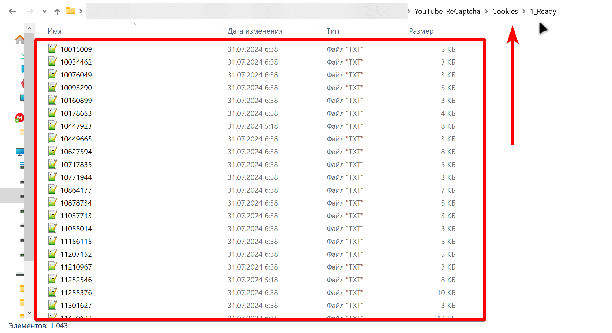

1️⃣ **Установите шаблон по этой видео инструкции**

[video:https://youtu.be/To7XvGZjkl4:]

**2️⃣ Укажите лицензионный ключ во входных настройках шаблона на вкладке «Лицензия»**

[image:./install.png:::0,0,100,100:100::1415px:420px]

**3️⃣Зарегистрируйте аккаунт на** [**CapMonster Cloud**](https://capmonster.cloud/ru/) **и пополните баланс больше чем на 1\$.**

{width=2304px height=936px}

**4️⃣ Скопируйте API ключ в буфер обмена и заполните поле CapMonster Cloud API во входных настройки шаблона на вкладке Конфигурация, а также укажите задание «Парсинг».**

{width=1404px height=588px}

**5️⃣Перенесите куки в формате NetScape в папку «\\YouTube-ReCaptcha\\Cookies\\1_Ready\\»**

{width=2003px height=1092px}

\
**6️⃣В файле 1_Channels_Urls.txt укажите построчно ссылки на каналы YouTube**

{width=2304px height=834px}

