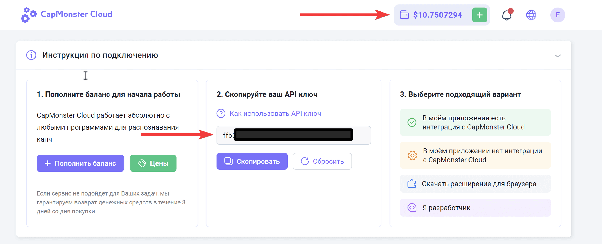

1. **Установите шаблон по этой видео инструкции**

[video:https://youtu.be/To7XvGZjkl4:]

1. Укажите лицензионный ключ во входных настройках шаблона на вкладке **Лицензия**

{width=1415px height=420px}

1. Зарегистрируйте аккаунт на [CapMonster Cloud](https://capmonster.cloud/ru/) и пополните баланс больше чем на 1\$.

2. Скопируйте API ключ в буфер обмена и заполните поле CapMonster Cloud API во входных настройки шаблона на вкладке **Конфигурация,** а также укажите задание «Парсинг».

{width=2304px height=936px}

{width=1404px height=588px}

1. Перенесите куки в формате NetScape в папку «\\YouTube-ReCaptcha\\Cookies\\1_Ready\\»

{width=2003px height=1092px}