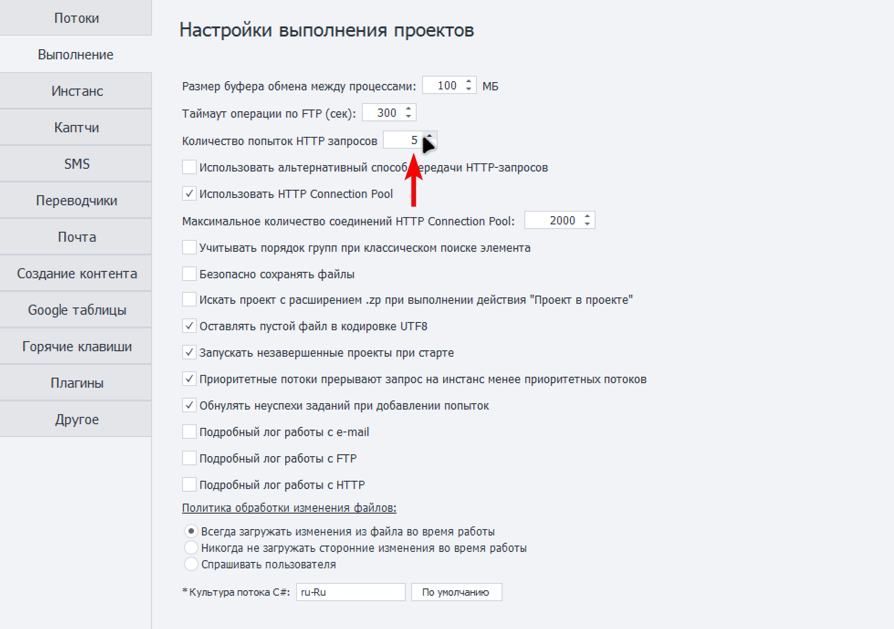
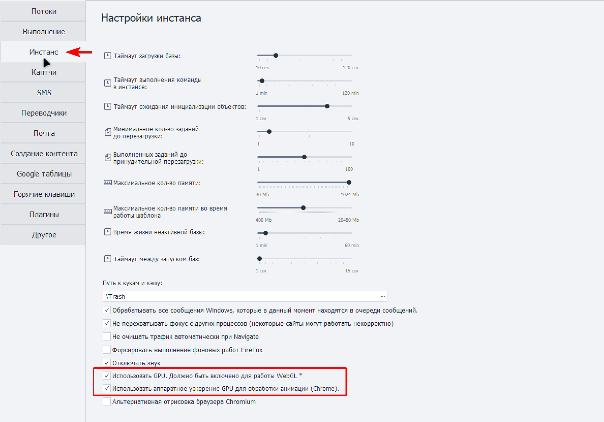
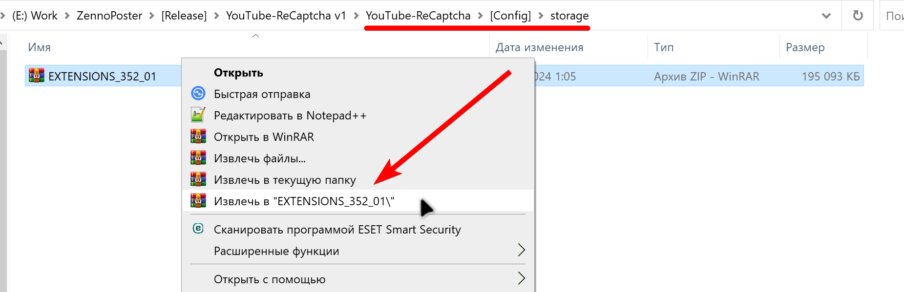

В настройках ZennoBox на вкладке «Выполнение» установите значение количества попыток HTTP-запросов на – 5.

{width=1959px height=1379px}

На вкладке Инстанс включите использование GPU для WebGL и аппаратное ускорение для обработки анимации.

{width=2304px height=1611px}

Также скачайте архив [Extensions.zip](http://Extensions.zip) из облака по дополнительной ссылке, которая была выдана вам после приобретения или обновления софта. Разархивируйте архив и перенесите содержимое в папку «../YouTube-ReCaptcha/\[Config\]/storage/».

{width=1851px height=599px}