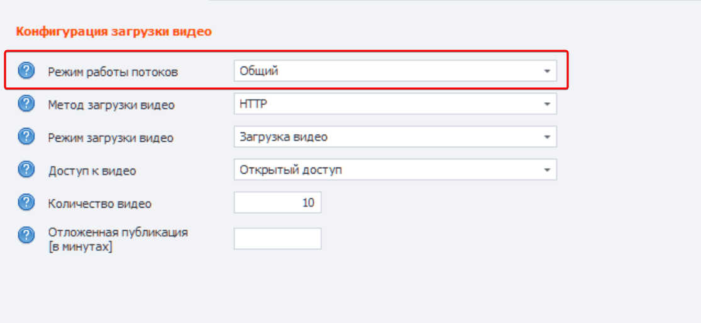

#### 🧊Источник данных

Поддерживаются **2** источника данных для загрузки видео:

1. **Файлы** – текстовые файлы

2. **Планировщик** – таблица Excel

Выбор источника данных зависит от того, важно ли в вашем проекте связывание видео с конкретными данными или, наоборот, необходимо загружать видео в случайном порядке без привязки к конкретным данным.

📑 **Файлы** – используются, если связывание данных не важно или требуется полная рандомизация.

📗 **Планировщик** – используется, когда важен порядок и сопоставление данных с видео.

#### **🔁Режим потоков**

Есть **3 режима потоков**, которые контролируют то, как будут использоваться `Файлы` с  данными при многопоточной загрузке видео, то есть когда одновременно идёт загрузка на несколько каналов.

1. **Общий** – потоки используют `Файлы` с данными и делят их между собой по принципу «первым пришёл, первым и обслужен».

2. **Изолированный** – для потока создаётся виртуальная локальная копия `Файлов` с данными. У всех потоков будет один и тот же набор данных, но в отличии от общего режима потоки не делят данные между собой.

3. **Выделенный** – к потоку привязываются `Файлы` с данными, которые задаёт пользователь. Поток берёт данные из текстовых файлов в частном порядке не пересекаясь с другими потоками.

⚠️ Выбор режима потоков имеет смысл только с источником: **Файлы**. Для **Планировщика** всегда выбирается поток: `Выделенный`.

{width=1115px height=515px}